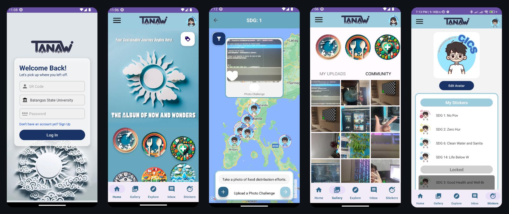

# TANAW: The Album of Now and Wonders


## Table of Contents

- [Project Overview](#project-overview)
- [Key Features](#key-features)
- [Requirements](#requirements)
- [Installation](#installation)
- [Usage](#usage)
- [Contributors](#contributors)
- [Acknowledgements](#acknowledgements)

## Project Overview
A mobile app designed to promote community engagement with the UN's Sustainable Development Goals (SDGs) through a gamified experience in SDG-themed photo challenges. The platform allows users to share photos centered around occasional SDG themes, fostering awareness and collaboration while capturing memories. 


## Key Features
1. **Photo Sharing and SDG Tagging**:
   - Upload and categorize photos related to specific SDGs, fostering global awareness.
2. **Customizable Avatars**:
   - Personalize map marker with personalized avatars.
3. **Search and Filters**:
   - Explore UN-partnered institutions and easily track recent uploads though filters.
4. **Location**:
   - Explore SDG-related content and events based on your current location.
5. **SDG-Themed Challenges**:
   - Participate in photo challenges aligned with the SDGs as you earn rewards and track your progress.


### Security Mechanisms
1. **Authentication**:
   - Email-based authentication with Supabase.
2. **Input Validation**:
   - Frontend and backend validation to prevent malicious inputs.
   - Sanitization of tags and filenames during uploads.
3. **Data Encryption**:
   - HTTPS for secure communication.
   - Encryption of sensitive data in transit and at rest.

## Requirements
- **Android Studio**: Ensure you have the latest stable version of Android Studio installed.
- **JDK 17**
- **Android SDK**: minimum SDK version of 28
- **Google Maps API Key**: Generate a Google Maps API key to use the Maps features in your app. This key should be added in the local.properties file.
- **Firebase Keys**: Add your Firebase google-services.json to your project.

### Dependencies
- Java 17
- Jetpack Compose
- Firebase Authentication
- Firebase Firestore
- Firebase Storage
- Firebase App Check
- Google Maps SDK
- CameraX

### Environment Variables
The following environment variables are required for the app to work:
- MAPS_API_KEY
These should be added to the local.properties file and ensure that your API key is kept private and not exposed in public repositories.


## Installation

1. **Clone the repository**:
   ```bash
   git clone https://github.com/username/TANAW.git
   ```
2. **Open the Project in Android Studio**:
- Open Android Studio and navigate to the your-repository directory and open the project.
3. **Configure the Local Properties**:
- Create or edit the local.properties file at the root of the project to include the following:
```properties
sdk.dir=/path/to/your/android/sdk
MAPS_API_KEY=your-maps-api-key
```
- Ensure to replace the placeholders with your actual credentials.

4. **Sync Project with Gradle**:
- Once the local.properties file is set up, sync your project with Gradle by clicking **File > Sync Project with Gradle Files** in Android Studio.

5. **Build and Run the Project**:
- After syncing, click Run to build and run the project on your emulator or device.

### Troubleshooting

- **SDK Version Issues**: Ensure that your Android SDK is compatible with the compileSdk and targetSdk versions specified in the build.gradle.kts file.
- **API Key Issues**: Double-check that your API keys are correctly placed in the local.properties file.
- **Dependency Resolution Issues**: If you encounter issues with dependencies, try cleaning the project and syncing again: **Build > Clean Project and File > Sync Project with Gradle Files.**

## Usage
Once the app is installed and running, users can sign up and create an account. After logging in, users can:
- Sign up and create an account.
- Upload and share photos tagged with SDG themes.
- Customize their avatar and personalize their profile.
- Explore SDG-related content and events using search and filter options.
- Participate in SDG-themed challenges, track progress, and earn stickers as rewards.

## Contributors

- Project Manager/ Fullstack Developer: **Danielle Ziac Abril**
- Frontend Developer: **Paul Oliver Cruz**
- Backend Developer: **Hersey Anne Odasco**

- Course Facilitator: **Mr. Poul Isaac De Chavez**

## Acknowledgement

We would like to express our heartfelt gratitude to everyone who contributed to the successful completion of this project:

1. **Instructor/Advisor** for guidance and support throughout the development.
2. **Team Members** for their dedication and collaboration in bringing this project to life.
3. **University and Department** for providing the resources and opportunities for this project.
4. **External Tools and Resources** that helped in the development of the app.
5. **United Nations SDG Framework and Related Resources** for inspiring the core concept of this project.
